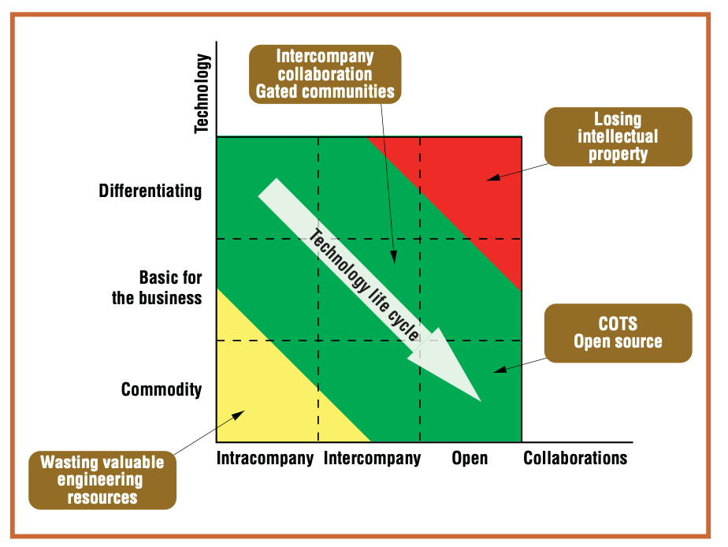

```{r setup, include=FALSE}
library(learnr)
library(shiny.i18n)
i18n <- Translator$new(translation_csvs_path = "./data")
i18n$set_translation_language("en")

knitr::opts_chunk$set(echo = FALSE)
```

## `r i18n$t("InnerSource - An Introductory Tutorial")`

### `r i18n$t("What is this tutorial for?")`

`r i18n$t("The commonly used definition of InnerSource states that it is")` _`r i18n$t("the use of best practices from successful open source projects and establishment of an open source culture within your organization")`_.

`r i18n$t("However, for the uninitiated, that may not convey a lot of meaning – what are these so-called")` _"`r i18n$t("best practices")`"_ `r i18n$t("and what does")` _"`r i18n$t("open source culture")`"_ `r i18n$t("even mean? If you have those questions, this tutorial is for you!")`

[InnerSource Commons](https://innersourcecommons.org/) `r i18n$t("is the go-to community for all InnerSource practitioners around the globe, has an excellent set of resources but they assume some amount of prior knowledge about the mechanisms of how Open Source and InnerSource works and they also have their own set of jargons. Our goal in this section and the next is to prepare you so that you can better understand what they are talking about and familiarize yourself further with InnerSource.")`

### `r i18n$t("Is this tutorial for you?")`

`r i18n$t("Do you need to work through the tutorial? Take the quiz below to find out.")`


```{r quiz1, echo = FALSE}
question(i18n$t("Check all options that are NOT TRUE for you:"),
  answer(i18n$t("I am familiar with what Open Source Software (OSS) is"), message =  i18n$t("* OSS Introduction")),
  answer(i18n$t("I am familiar with how OSS development is different from proprietary/corporate software development"), message = i18n$t("* OSS Development Basics")),
  answer(i18n$t("I am familiar with what InnerSource is"), message = i18n$t("* InnerSource Introduction")),
  answer(i18n$t("I am familiar with all InnerSource terminologies"), message =  i18n$t("* InnerSource Terms Glossary")),
  answer(i18n$t("None of the above. I am confident about my knowledge about these topics."), correct = TRUE, message = i18n$t("You can skip this tutorial! You can know more about InnerSource at <https://innersourcecommons.org/learn/>")),
  type = "multiple",
  incorrect =  i18n$t("This tutorial is here to help! Please go through:")
)
```

## `r i18n$t("OSS Introduction")`

`r i18n$t("Open-source software (OSS) is a type of computer software in which source code is released under a license in which the copyright holder grants users the rights to use, study, change, and distribute the software to anyone and for any purpose as long as it adheres to the license restrictions (e.g. some OSS licenses explicitly forbid monetizing the product for profit and almost all licenses require the name of the original author(s) of the software be mentioned in any future distributions).")`

`r i18n$t("In contrast, the primary business model for closed-source software involves the use of constraints on what can be done with the software and the restriction of access to the original source code. The end result is that an end-user is not actually purchasing software, but purchasing the right to use the software. The source code to closed-source software is considered a trade secret by its manufacturers.")`

`r i18n$t("The top four reasons (as provided by the")` [Open Source Business Conference survey](https://www.cmswire.com/cms/web-cms/bad-economy-is-good-for-open-source-004187.php)) `r i18n$t("individuals or organizations choose open-source software are:")`

1. `r i18n$t("Lower cost")`
1. `r i18n$t("Security")`
1. `r i18n$t("No vendor 'lock in'")`
1. `r i18n$t("Better quality")`

`r i18n$t("Both the number of OSS projects and the number of developers contributing to OSS projects have reached staggering heights, and OSS has become a critical component of our modern digital infrastructure, for example, you might be familiar with the widely popular **LAMP** stack, namely, **L**inux, **A**pache, **M**ySQL, **P**HP/**P**erl/**P**ython, which is a set of open source software widely used for web application development.")`

`r i18n$t("The topic of OSS is vast, so we will stop the introduction here. There are numerous resources about OSS that you can read to know more about it. We suggest you to start with the")` [`r i18n$t("Wikipedia page for Open Source Software")`](https://en.wikipedia.org/wiki/Open-source_software).

## `r i18n$t("OSS Development Basics")`

`r i18n$t("Open Source Software development is typically very different from the software development process within a company. The open source model is a decentralized software development model that encourages open collaboration. Open collaboration is defined as")`: _`r i18n$t("'any system of innovation or production that relies on goal-oriented yet loosely coordinated participants who interact to create a product (or service) of economic value, which they make available to contributors and noncontributors alike.'")`_ `r i18n$t("and many of the characteristics of OSS development are derived from this development style.")`

### `r i18n$t("The Cathedral and the Bazaar")`

`r i18n$t("In his 1997 essay [The Cathedral and the Bazaar](http://www.catb.org/~esr/writings/cathedral-bazaar/cathedral-bazaar/index.html), Eric S. Raymond highlighted the differences between the traditional on-premise software development and the open source development.")`

`r i18n$t("Raymond likens the development of software by traditional methodologies to building a cathedral,")` _`r i18n$t("'carefully crafted by individual wizards or small bands of mages working in splendid isolation")`'_. `r i18n$t("Here development takes place in a centralized way. All roles are clearly defined. Roles include people dedicated to designing (the architects), people responsible for managing the project, and people responsible for implementation.")`

`r i18n$t("In contrast, OSS is often developed in a bazaar style, which Raymond described as")` _`r i18n$t("'a great babbling bazaar of differing agendas and approaches.'")`_ `r i18n$t("In this model, roles are not clearly defined. However, it is far from pure chaos that some people think it is - it is typically a bit messy but people often find what they are looking for. A few key characteristics of this bazaar style development are:")`

- **`r i18n$t("Users should be treated as co-developers")`**: `r i18n$t("The users are treated like co-developers and so they should have access to the source code of the software, and are encouraged to submit new features, code fixes, bug reports, documentation, etc. Having more co-developers increases the rate at which the software evolves. Linus's law states, 'Given enough eyeballs all bugs are shallow.' This means that if many users view the source code, they will eventually find all bugs and fix them.")`

- **`r i18n$t("Early releases")`**: `r i18n$t("The first version of the software should be released as early as possible so as to increase one's chances of finding co-developers early.")`

- **`r i18n$t("Frequent integration")`**: `r i18n$t("Code changes should be integrated (merged into a shared code base) as often as possible so as to avoid the overhead of fixing a large number of bugs at the end of the project life cycle. Some open-source projects have nightly builds where integration is done automatically on a daily basis.")`

- **`r i18n$t("Several versions")`**: `r i18n$t("There should be at least two versions of the software. There should be a buggier version with more features and a more stable version with fewer features. The buggy version (also called the development version) is for users who want the immediate use of the latest features, and are willing to accept the risk of using code that is not yet thoroughly tested. The users can then act as co-developers, reporting bugs and providing bug fixes.")`

- **`r i18n$t("High modularization")`**: `r i18n$t("The general structure of the software should be modular allowing for parallel development on independent components.")`

- **`r i18n$t("Dynamic decision-making structure")`**: `r i18n$t("There is a need for a decision-making structure, whether formal or informal, that makes strategic decisions depending on changing user requirements and other factors. Compare with extreme programming.")`

### `r i18n$t("Product vs. Project")`

`r i18n$t("Another key difference between the traditional software and OSS is that OSS is often distributed without a guarantee. This is because in contrast to a typical software product, OSS software are often ongoing projects. The source code is made available, so the onus is on the user to make it work as they intend it to work. However, typically users can and do get support from the community, where more experienced users might suggest ways to fix the problems.")`

### `r i18n$t("OSS Communities")`

`r i18n$t("You must have noticed in the previous sections that the term 'community' has appeared several times. In fact, the importance of an engaging community for the success of OSS can't be overstated. The users who turn into contributors, help new users with any problems, and attract more users by spreading the word are absolutely essential for an open source software to flourish.")`

`r i18n$t("OSS developers are also acutely aware of this fact, in fact, the motto of the Apache Software Foundation, a community of a large number of hugely successful OSS projects, is 'Community over Code', which means that the most successful long-lived projects value a broad and collaborative community over the details of the code itself. They mention that:")` _"`r i18n$t("Obviously, the code needs to be useful; that’s what makes it worthwhile to work on over time. But while the best code around right now may turn into a tool that everyone uses today, the best community around will create and maintain a project that everyone helps build and improve for the long term.")`"_

## `r i18n$t("InnerSource Introduction")`

`r i18n$t("In this section, we will try to break down the jargons and terminologies used by the InnerSource community and try to lucidly explain the key ideas about InnerSource.")`

### `r i18n$t("OSS Best Practices and Culture")`

`r i18n$t("Just as every project in a company are different, every OSS project is different. In fact, OSS projects often show a lot more diversity since people all over the globe can contribute to an OSS project. However, software engineering practitioners and researchers have identified a number of practices undertaken by many of the successful OSS projects that they believe are beneficial for more efficient software development in general. The term 'OSS Best Practices' refers to the these set of practices, referring to how OSS projects handle the creation of requirements, selecting which features are to added, code creation, code review, bug fixes etc.")`

`r i18n$t("The 'Open Source Culture' refers to how the contributors to a project treat  each other and how the privileges are distributed. Typically, OSS follows a meritocratic system where the people who contribute the most to a project are given the most privileges and honors. The importance that is given to creating and fostering a community is also another hallmark of the OSS development. Many of these cultural values are different from the culture within a company, where the management structure tends to be quite different.")`

`r i18n$t("In is not always easy to integrate these practices and cultural values with the typical software development process within a company since the governance structure tends to be different and pretty rigid. However, many of the end goals are also different and, just like many other things in life, there is no 'one-size-fits-all' solution to software development. Van der Linden et al., in their 2014 paper 'Commodification of Industrial Software: A Case for Open Source', showed where open style development (Open Source/InnerSource) is most suitable in the following plot:")`

```{r , echo=FALSE, fig.cap="", out.width = '60%'}

```

### `r i18n$t("Revisting the InnerSource Definition")`

`r i18n$t("Let us revisit the definition of InnerSource with the context described above. The goal of InnerSource is not to completely replace the existing software development practices, but to leverage the knowledge and benefits of Open Source development where it is most suitable. In contrast to OSS development, the resulting software is not openly distributed and, almost always, the contributors to the 'InnerSource' projects are the developers within the same company. So this is like creating a microcosm of Open Source within the company.")`

### `r i18n$t("Why InnerSource Matters")`

`r i18n$t("As you saw in the figure earlier, some types of software developed within a company can benefit a lot by adopting the Open Source style development. These benefits are amplified for larger companies. This fosters code reuse, so that different departments do not have to write and maintain separate code from scratch for doing very similar things. This also helps in better understanding of the requirements for the software which is used by different departments and, by virtue of having more users, improves the quality and fosters innovation.")`

`r i18n$t("Arguably, the biggest benefit of InnerSource, i.e. adopting the Open Source style development, is breaking down the silos and knowledge sharing. Teams that work in very niche projects for a long time tend to develop their own 'hacks' for doing certain things that might be completely unknown to the rest of the people in the company. This works as long as status quo is maintained, but, if a new developer joins the team or if some important member of the team leaves, it becomes extremely problematic. A similar situation might happen if a team was using some tool from a third-party vendor, and the vendor leaves - the tool might become unusable. These risks can be mitigated by adopting InnerSource for such projects, which keeps the knowledge accessible to the relevant members of the company and is beneficial for the company in the long run.")`

### `r i18n$t("Further Reading")`

`r i18n$t("This was a very brief and basic introduction to InnerSource. Keeping the spirit of InnerSource in mind, we are trying to stand on the shoulder of giants, which in this case refers to the InnerSource Commons community. With the basic understanding of InnerSource that you now have, we encourage you to delve deeper into this useful and exciting practice by visiting")` <https://innersourcecommons.org/learn/learning-path/>

## `r i18n$t("InnerSource Terms Glossary")`

`r i18n$t("In this section, we list various terms widely used in the InnerSource community so that it is easy to understand what they might be referring to. Many of the definitions are courtesy of the InnerSource Commons community and Danese Cooper and Klaas-Jan Stol's book")` [Adopting InnerSource](https://innersourcecommons.org/learn/books/adopting-innersource-principles-and-case-studies/).

### `r i18n$t("[A]")`

**`r i18n$t("Air cover")`**: `r i18n$t("Refers to executive management support for a potentially vulnerable change initiative, such as an InnerSource program. Having support at the highest level helps to get things done and to ensure that mid-level managers cannot block an initiative.")`

**`r i18n$t("Anti-Patterns")`**:  `r i18n$t("InnerSource practices that are considered harmful and can lead to the failure of a project, presented in a codified format.")`

**`r i18n$t("Apache Software Foundation (ASF)")`**: `r i18n$t("An American nonprofit organization that supports Apache Open Source software projects, including the Apache HTTPd web server. Founded in 1999, the ASF is home to the world’s largest single-license Open Source software repository with over 350 projects and more than 5,000 contributors. The Apache Way is a documented method for transparent peer-based collaborative software development upon which InnerSource is based.")`

### `r i18n$t("[B]")`

**`r i18n$t("Benevolent Dictator for Life (BDFL)")`**: `r i18n$t("The term BDFL is commonly used in Open Source projects with a single leader, who is often (but not necessarily) its original creator. The term first appeared in 1995 referring to Python’s creator Guido van Rossum. A BDFL oversees a project and has the final say in key decisions related to a project’s future development direction. Not all Open Source projects have BDFLs.")`

<!-- **Bosch Internal Open Source (BIOS)**: BIOS stands for Bosch Internal Open -->
<!-- Source, which is the name for Bosch’s -->
<!-- first InnerSource program. Starting in -->
<!-- 2009, the BIOS program was a three-year experiment (later extended by an -->
<!-- additional three years) to evaluate the -->
<!-- utility of Open Source development -->
<!-- practices for corporate software development. BIOS evolved into Bosch’s -->
<!-- Social Coding program. -->

**`r i18n$t("Bottleneck")`**: `r i18n$t("A metaphor that denotes when the capacity of a system or organization is limited by one component or team— the bottleneck.")`

**`r i18n$t("Brooks’s Law")`**: `r i18n$t("An observation by Frederick Brooks, who was project manager for IBM’s OS/360 project, that adding more people to a project that is already late, will make it later. The explanation for this is that new people need to be onboarded onto the project, the combinatorial explosion of the number of communication links in larger groups of people, and the limited extent to which tasks can be divided over multiple people.")`

### `r i18n$t("[C]")`

**`r i18n$t("Champion")`**: `r i18n$t("A person who helps advocate an InnerSource program, by serving as a contact point, a domain expert, or a leader to help other teams onboard and even arbitrate in an InnerSource program.")`

**`r i18n$t("Charter conflict")`**: `r i18n$t("Charter conflict is a common management problem where two or more individuals or teams each believe a given area of effort is their sole responsibility, which leads to both working in the same problem space, often with duplicated effort, and eventual hurt feelings. Clear guidance from leadership can avoid or resolve charter conflict.")`

**`r i18n$t("Cheese, wedge of cheese")`**: `r i18n$t("A metaphor for an executive manager (see Cheese Story).")`

**`r i18n$t("Cheese Story")`**: `r i18n$t("The Cheese Story describes how disagreements and conflicts get escalated up the management chain to executives, which are drawn as a wedges of cheese. When escalation occurs, one division’s “cheese” discusses the team’s wishes with the other division’s cheese, who will then discuss the issue with his or her engineers. This out-of-band intervention runs counter to InnerSource communication, collaboration, and decision-making processes, all of which are generally more direct.")`

<!-- **Chief Architect**: A key role in the core team in Bell Laboratories’ SIP project. The Chief Architect typically has intimate knowledge of -->
<!-- the software asset. -->

<!-- **Code Guardian**: A role in Ericsson’s CDS initiative. The -->
<!-- Code Guardian is one of three roles -->
<!-- (besides Product Owner and Architect) -->
<!-- in Ericsson’s core teams. The Code -->
<!-- Guardian is to "guard the quality of the -->
<!-- code" by reviewing contributions from -->
<!-- individuals and teams. -->

<!-- **Community Developed Software (CDS)**: CDS is an InnerSource program within -->
<!-- Ericsson that started with the company’s attempt to build a platform without a platform organization. Within the -->
<!-- CDS, core teams are responsible for -->
<!-- designing and delivering components -->
<!-- with well-defined interfaces that feature -->
<!-- teams can use to implement the functionality they need. -->

**`r i18n$t("Continuous Integration (CI)")`**: `r i18n$t("First coined as a term by Grady Booch, IBM Fellow and co-inventor of the Unified Modeling Language (UML), and also one of the original 12 practices of Extreme Programming (XP), CI is the practice of integrating code changes into the master code repository to ensure that no defects are introduced that break the system as a whole.")`

<!-- **Contributing.md file**: A file offered in every project setup that -->
<!-- memorializes working agreements -->
<!-- between guest contributors and host -->
<!-- code owners, as well as the process for -->
<!-- making, reviewing, merging, and supporting contributions (the .md extension suggests it’s written in Markdown, -->
<!-- which is supported in many modern -->
<!-- version control systems). -->

**`r i18n$t("Core Team")`**: `r i18n$t("Many successful Open Source projects have a core team that consists of a relatively small number of key contributors. Some projects define a core team to consist of a BDFL and Trusted Lieutenants. Others define a core team by the architecture of the project, for instance, the core team may work on the core engine while everyone else works on modules that the core engine acts on. Companies adopting InnerSource sometimes adopt the concept of a core team, but they may redefine what that means for their context.")`

<!-- **Corporate Open Source (COS)**: The term originally used at Bell Laboratories for InnerSource. -->

### `r i18n$t("[D]")`

<!-- **Delivery advocate**: A role in Bell Laboratories’ SIP project’s -->
<!-- core team that assists business units in the task of integrating the shared assets -->
<!-- into the business units’ software. We’ve -->
<!-- also seen the concept of a delivery -->
<!-- advocate in other companies, though -->
<!-- they didn't use the term. -->

### `r i18n$t("[E]")`

**`r i18n$t("Executive air cover")`**: `r i18n$t("See: Air cover.")`

### `r i18n$t("[F]")`

<!-- **Feature advocate**: A role defined in Bell Laboratories’ SIP -->
<!-- project’s core team. The feature advocate is responsible for seeing a certain -->
<!-- feature to completion. -->

### `r i18n$t("[G]")`

**`r i18n$t("Guest contributor")`**: `r i18n$t("A term used in PayPal’s InnerSource program, to refer to a contributor external to the owning team (Host team).")`

### `r i18n$t("[H]")`

**`r i18n$t("Host team")`**: `r i18n$t("A term used in PayPal’s InnerSource program, to refer to the team that mentors, accepts, and reviews contributions from guest contributors. See also: Guest Contributor.")`

### `r i18n$t("[I]")`

**`r i18n$t("Infrastructure-based InnerSource")`**: `r i18n$t("A variant of InnerSource whereby an organization provides the necessary infrastructure for anyone to start a new community. In this model, the organization doesn't provide any resources to support a dedicated core team to develop or maintain a specific project. See also: Project-specific InnerSource.")`

**`r i18n$t("Inner Source")`**: `r i18n$t("The term coined by Tim O’Reilly in 2000 to refer to the idea of leveraging Open Source development practices for corporate software development. The InnerSource Commons has adopted 'camel case' spelling: InnerSource.")`

**`r i18n$t("InnerSource")`**: `r i18n$t("Alternative spelling for “Inner Source” (the original spelling coined by Tim O’Reilly). The one-word spelling was chosen by the InnerSource Commons community to make the term more searchable on the internet.")`

**`r i18n$t("InnerSource Commons")`**: `r i18n$t("Founded in 2015, the InnerSource Commons is an organization of individuals working on sharing experiences, developing public educational materials, and supporting each other as they work on InnerSource implementations either for their employers or as consultants. This group meets online at")`
<https://innersourcecommons.org>.

<!-- **IRC**: Internet Relay Chat. Chat server software that was invented in 1988 and is -->
<!-- still commonly used by Free and Open -->
<!-- Source projects. Many alternative communication and collaboration platforms -->
<!-- exist today with similar features. One of -->
<!-- the better known commercial platforms -->
<!-- is _Slack_. -->

### `r i18n$t("[J]")`

### `r i18n$t("[K]")`

### `r i18n$t("[L]")`

<!-- **Liaison**: A formalized role in Bell Laboratories’ -->
<!-- SIP InnerSource project. The Liaison -->
<!-- plays a key role in managing the core -->
<!-- team’s activities, and is the interface to -->
<!-- business units who wish to discuss new -->
<!-- work requests. Within the SIP project, -->
<!-- the liaison works closely with the Chief -->
<!-- Architect. -->

**`r i18n$t("Linus’s law")`**: `r i18n$t("Originally coined by Eric Raymond in his essay ''The Cathedral and the Bazaar'': 'Given enough eyeballs, all bugs are shallow.' In other words, bugs that may seem inexplicable to some might be obvious to others, as long as a sufficient number of people that look at the code. The limitations of Linus’s law were demonstrated when the “Heartbleed” bug was introduced into OpenSSL in December 2011, released in March 2012, and neither noticed nor fixed until April 2014.")`

### `r i18n$t("[M]")`

**`r i18n$t("Modularity")`**: `r i18n$t("Modularity refers to the extent to which a software program’s parts are coupled. A high degree of modularity means that modules are very loosely coupled, which in turn means that changes in one module result in a minimal number of changes in other modules. A low degree of modularity means that modules are tightly coupled, which in turn means that a change in one module may require significant changes in all coupled modules.")`

### `r i18n$t("[N]")`

### `r i18n$t("[O]")`

### `r i18n$t("[P]")`

**`r i18n$t("Patterns")`**:  `r i18n$t("InnerSource best practices codified in a specific format to make it easy to understand, evaluate, and apply in a specific context.")`

**`r i18n$t("Product Owner (PO or PMO)")`**: `r i18n$t("A key role in the Scrum development framework, the most popular Agile development method. The PO represents the voice of the customer, and has as a key responsibility the maintenance of the product backlog of planned features expressed as “stories” - the role also typically includes setting development priorities for the product.")`

**`r i18n$t("Project-specific InnerSource")`**: `r i18n$t("A variant of InnerSource that focuses specifically on one or a few projects that have dedicated teams, typically supported by corporate funding or by business units. The dedicated “core team” is responsible for maintaining a roadmap and the asset’s architectural consistency. See also: Infrastructure-based InnerSource.")`

**`r i18n$t("Pull request (PR)")`**: `r i18n$t("A set of proposed changes to source code that includes metadata such as review comments. A PR is the mechanism used in distributed (or decentralized) source code  management systems such as Git and Bitbucket. In centralized code management systems (such as Subversion), changes to source code would typically be captured in a patch that does not include the metadata that a PR has.")`

### `r i18n$t("[Q]")`

### `r i18n$t("[R]")`

### `r i18n$t("[S]")`

**`r i18n$t("Scrum")`**: `r i18n$t("Possibly the most popular Agile method for software development. Scrum defines a number of roles (see Scrum Master, Product Owner), artifacts (e.g., product backlog), and ceremonies, such as the Daily Standup (or Daily Scrum). Being an Agile method that recommends a maximum team size of about 7 to 9 people and that emphasizes face-to-face communication, many companies that adopted Scrum have difficulty scaling up their software development efforts. InnerSource can help in this regard.")`

**`r i18n$t("Scrum Master (SM)")`**: `r i18n$t("A key role in the Scrum development framework, the Scrum Master works to ensure a given team is following all the steps of Scrum, including regular short meetings to discuss daily work, pulling specific assignments from a backlog of feature descriptions called stories, and completing a show and tell of progress called a “demo” at the end of every planned work interval (a sprint), typically two to four weeks in duration.")`

**`r i18n$t("Silos")`**: `r i18n$t("Metaphor to describe the typical arrangement in large corporations, where each division (or large collection of code) is a separate, independent entity with very little collaboration and communication between them. Silos often compete for budget and resources, and this competition further undermines collaboration and communication. <br> The term is also used to refer to the teams/the closed mindset of the teams that continually work in some niche projects with little to no collaboration and develop their own 'hacks' for dealing with different things, which further complicates collaboration.")`

### `r i18n$t("[T]")`

**`r i18n$t("Trusted Committer")`**: `r i18n$t("The Trusted Committer (TC) role is one of the key roles in an InnerSource community. Think of Trusted Committers as the people in a community that you trust with important technical decisions and with mentoring contributors to ultimately get contributions over the finish line. For further details, see <https://innersourcecommons.org/learn/learning-path/trusted-committer/>. <br> Other terms used to refer to the same role: 'Trusted Contributor', 'Trusted Lieutenant'.")`

### `r i18n$t("[U]")`

### `r i18n$t("[V]")`

### `r i18n$t("[W]")`

**`r i18n$t("Walls")`**:`r i18n$t(" When referred to in the context of 'Silos', it refers to the barrier of entry for new developers into the project. The biggest contributing factor to the barrier of entry is typically the knowledge that exists within the current developers of the project, but is not documented anywhere.")`

### `r i18n$t("[X]")`

### `r i18n$t("[Y]")`

### `r i18n$t("[Z]")`
